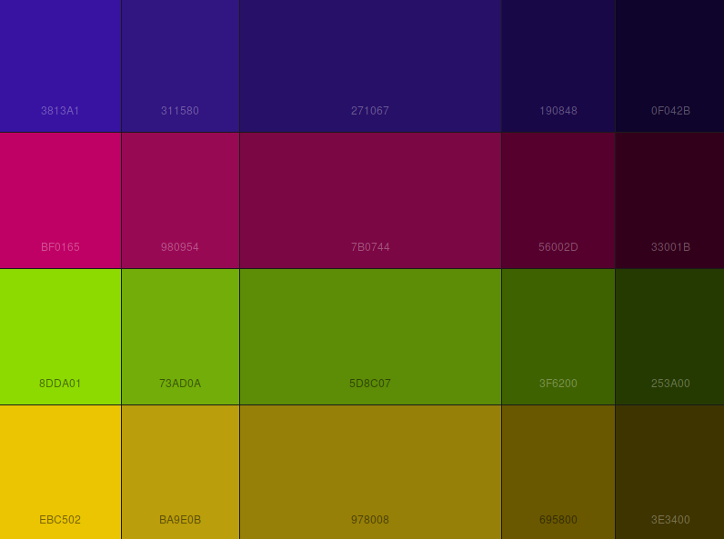

# LorisWeb
* Main repository of the Loris Industrial Intelligence web application
* **Objetivos da plataforma**
  * Fornecer um ambiente completo de monitoramento em tempo real de parâmetros físicos
  * Além dos dados “crus”, entregaremos análises e interpretações dos dados

* **Requisitos gerais**
  * Responsivo
  * Flexível (modular)
  * "High tech"
  * Fácil de usar
  * Permitir comparações simultaneas de varias localidades
  * Fornecer alguns modelos fixos de visualização, mas permitindo escolher as variáveis visualizadas

## Repository File structure

* **landing page**
  * Initial page, to the extern public
  * Estatic, made with boostrap (I used a w3 template)
* **loris.system**
  * main application
  * nodejs + vueCli
* **examples**
  * black-dashboard-master: template from [CreativeTim](https://www.creative-tim.com/product/black-dashboard)
  * simples-dashboard: template from [startbootstrap](https://startbootstrap.com/themes/sb-admin-2/)
  * simple-sidebar: template from [startbootrap](https://startbootstrap.com/templates/simple-sidebar/)
* **dataBase**
  * codes and documentation of the database
  * PostgreeSQL
* **pythonCodes**
  * Test, exercices and real analysis using python
  * IDE used: jupiter nodebooks

## Implementation guidelines

* **Database**
  * postgree
  * db Proami
  * TODO: ER diagram
* **Backend: nodeJS**
  * REST API (db access)
  * athentication and access control
  * Data analisys (only on demand)
* **Front end**
  * VueJS, usando CLI
  * bootstrap

## Loris.system pages

* Cada página possui um JSON de configuração de determina quais gráficos ela vai conter 

* Esse JSON possui apenas a modelagem abstrata da página, ignorando estilização

* **Home**

  * Aprensenta um resumo e as principais informações sobre a fábrica
  * Alertas (consumo excessivo, velocidade máxima atingida, máquina parada, etc)
  * Atualizações (no sistema, na fábrica, no setor, etc)
  * Indicadores diários (se tudo vai bem: produção, consumo, etc)
  * Estatísticas gerais (número de equipamentos instalados, problemas recentes, etc)

* **Bashboard**

  * Grid de gráficos, dispostos de forma a facilitar a comparação
  * Array of generic cards:

  ```javascript
  [{
      "type": "vetorTrifasico | temporalCrua | table | etc...",
      "title": "",
      "subtitle": "",
      "yAxis": "",
      "xAxis": "",
      "updatePeriod": number (in seconds)
      "series":[]
  },
  {
      ...
  }]
  ```

## Card models

* **Série temporal simples**
  * Vue component: cardTemporalSimple
  * https://www.highcharts.com/demo/line-basic 
  * Se receber apenas uma fase, omite a legenda
  * Propriedades do card
    * location: uid do dispositivo embarcado
    * aggregationTime: tempo sobre o qual é calculado a média (em segundos)
  * Propriedades de cada série
    * name: o que vai aparecer no front
    * variable: o que vai ser puxado o banco de dados
    * data: array com os pontos
  * Exemplo de card JSON: 

``` JSON
{
    "type": "cardTemporalSimple",
    "title": "Tensão por fase (KV)",
    "updatePeriod": 600,
    "location": "000001",
    "aggregationTime": 300,
    "series":[
    	{
            "name": "Fase A",
            "variable": "ta",
            "data": [222, 230, 225, 230]
        },{
            "name": "Fase B",
            "variable": "tb",
            "data": [212, 220, 210, 215]
        },{
            "name": "Fase C",
            "variable": "tc",
            "data": [202, 225, 205, 200]
        }
	]
}
```

* **Série temporal com janela de tempo**
  * Vue component: cardTemporalWindow
  * https://www.highcharts.com/stock/demo/basic-line
* **Série temporal aglomerada**
  * Vue component: cardTemporalAgregated
  * https://www.highcharts.com/stock/demo/column
* **Vetor trifásico**
  * estilo MedFase
* **Tabela instantânea**
  * ?
* **Gauge de excesso**
  * ?
* **Heat map de utilização**
  * Só será possível fazer sob demanda (por causa do mapa da fábrica), e apenas quando houver vários sensores instalados
  * https://www.highcharts.com/maps/demo/heatmap


# Design 

* Default font: helvetica neue
* theme: dark blue

## Color palette

* quadrica, angulada 60º

```css
/* CSS - Cascading Style Sheet */
/* Palette color codes */
/* Palette URL: http://paletton.com/#uid=74g0X0kuiiUvNtru4nlwudexs7O */
/* Feel free to copy&paste color codes to your application */


/* As hex codes */

.color-primary-0 { color: #271067 }	/* Main Primary color */
.color-primary-1 { color: #3813A1 }
.color-primary-2 { color: #311580 }
.color-primary-3 { color: #190848 }
.color-primary-4 { color: #0F042B }

.color-secondary-1-0 { color: #7B0744 }	/* Main Secondary color (1) */
.color-secondary-1-1 { color: #BF0165 }
.color-secondary-1-2 { color: #980954 }
.color-secondary-1-3 { color: #56002D }
.color-secondary-1-4 { color: #33001B }

.color-secondary-2-0 { color: #5D8C07 }	/* Main Secondary color (2) */
.color-secondary-2-1 { color: #8DDA01 }
.color-secondary-2-2 { color: #73AD0A }
.color-secondary-2-3 { color: #3F6200 }
.color-secondary-2-4 { color: #253A00 }

.color-complement-0 { color: #978008 }	/* Main Complement color */
.color-complement-1 { color: #EBC502 }
.color-complement-2 { color: #BA9E0B }
.color-complement-3 { color: #695800 }
.color-complement-4 { color: #3E3400 }


/* As RGBa codes */

.rgba-primary-0 { color: rgba( 39, 16,103,1) }	/* Main Primary color */
.rgba-primary-1 { color: rgba( 56, 19,161,1) }
.rgba-primary-2 { color: rgba( 49, 21,128,1) }
.rgba-primary-3 { color: rgba( 25,  8, 72,1) }
.rgba-primary-4 { color: rgba( 15,  4, 43,1) }

.rgba-secondary-1-0 { color: rgba(123,  7, 68,1) }	/* Main Secondary color (1) */
.rgba-secondary-1-1 { color: rgba(191,  1,101,1) }
.rgba-secondary-1-2 { color: rgba(152,  9, 84,1) }
.rgba-secondary-1-3 { color: rgba( 86,  0, 45,1) }
.rgba-secondary-1-4 { color: rgba( 51,  0, 27,1) }

.rgba-secondary-2-0 { color: rgba( 93,140,  7,1) }	/* Main Secondary color (2) */
.rgba-secondary-2-1 { color: rgba(141,218,  1,1) }
.rgba-secondary-2-2 { color: rgba(115,173, 10,1) }
.rgba-secondary-2-3 { color: rgba( 63, 98,  0,1) }
.rgba-secondary-2-4 { color: rgba( 37, 58,  0,1) }

.rgba-complement-0 { color: rgba(151,128,  8,1) }	/* Main Complement color */
.rgba-complement-1 { color: rgba(235,197,  2,1) }
.rgba-complement-2 { color: rgba(186,158, 11,1) }
.rgba-complement-3 { color: rgba(105, 88,  0,1) }
.rgba-complement-4 { color: rgba( 62, 52,  0,1) }


/* Generated by Paletton.com © 2002-2014 */
/* http://paletton.com */
```

