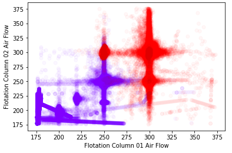
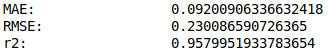

# Análise exploratória

* **Objectives**
  * predict the % of silica in the iron ore concentrate (last column)
  * preferencialmente sem usar a coluna “% Iron Concentrate”
* Correlação matrix plot (the printed matrix is in a txt file)

* variables pair plot (with KDE in the diagonals)

* * *

# **Clustering**

* Tentei clusterizar enfocando na concentração de sílica (objetivo do dataset), mas aparentemente não existe padrão que interesse esteje relacionado à isso

* O pouco que deu para separar foram pontos do operação no que se refere à sílica feed, porém acredito (baseando-me nas discussões no Kaggle) que essa padrão seja irrelevante.

* Entretanto, observei um claro padrão clusterizável em relação aos air flows. Se obtivermos variáveis de elétricas podemos relacionar esses clusters de operação à eficiência energética da máquina

* **Mensaguem**

  Olá Eduardo, tudo bem?

  Sou pesquisador do Laboratório de Pesquisa em Redes Elétrica Inteligentes (Labsmart), do Instituto Federal de Santa Catarina. Atuamos principalmente na área de *Sistemas de Gerenciamento Energético*, e agora estamos desenvolvendo um projeto para melhorar a eficiência de processos industriais, focando na área de mineração.

  Estou entrando em contato por causa da base da dados que o senhor publicou na Kaggle, Quality Prediction in a Mining Process. 

  Durante nossa análise exploratória nos dados percebemos que existia dois patamares distinguíveis na operação, relacionados principalmente aos níveis de Air Flow. Aplicamos um algoritmo de *clustering* aos dados, e o padrão inicialmente percebido de fato comprovou-se válido e fácilmente separável. 

  Apesar desses dois padrões de operação não estarem aparentemente relacionados com o % de sílica, acreditamos eles possam estar relacionados à *eficiência energética* do processo e, dessa forma, podemos ser capazes de determinar o ponto ótimo de funcionamento das máquinas, determinar o melhor setup para o processo, entre outras otimizações. Naturalmente, estamos dispostos a cooperar com a mineradora no compartilhamento destes resultados e no desenvolvimento de futuros projetos. 

  Entretanto, para isso precisamos obter alguns *dados elétricos* sobre esse processo, de forma que possamos fazer inferências sobre a eficiência energética desses clusters de operação. O senhor teria como nos fornecer alguns dados desse gênero? 

## **Algoritmo**

* **Pré processamento**
  * Normalização min-max
  * Observando que muitas das features não possuiam relação com o *air flow*, pesou-se cada coluna pela sua correlação (pearson correlation) com a coluna Flotation Column 01 Air Flow, diminuindo o ruído no resultado final
  * Desconsiderou-se a feature *date*, pois estamos interessados em analisar o ponto instantâneo de operação
* **Algoritmo de clustering**
  * Optou-se pelo algoritmo K means, pela simplicidade e facilidade de implementação
  * Utilizou-se o *elbow method* para identificar o numero ideal de clusters: 2

## **Resultados**

* Plotando algumas variáveis, separadas pelos clusters:

* **Distribution plot for *Flotation Column 01 Air Flow***

  * Cluster 1
    * count    493578
    * mean     298.8
    * std      7.6 
  * Cluster 2
    * count    243875
    * mean     242.3
    * std      19.9

  

* **Distribuition plot for *Flotation Column 07 Air Flow***

  * Cluster 1
    * count: 493578
    * mean: 303.8
    * std: 20.1 
  * Cluster 2
    * count: 243875
    * mean: 264.3
    * std: 24.9

  

# Regression 1: random forrest

* Foco: desempenho

* Este código foi altamente baseado na implementação de Roger Bellavista, disponível em https://www.kaggle.com/rogerbellavista/randomforestregressor-mae-0-0922-rmse-0-2314

* O algoritmo é simples e muito “off the shell”, porem o autor do dataset comentou (no código original):

  ​	 *If the predictions (test set)  has a MAE and RMSE of around 1 +-0.2, it 
  is a really good result! The challenge is to have these results for a 
  long term. Of course, remember that in a real process, the client only 
  have a new value of silica every 3-4hour. So, if we deliver a prediction
  with an error arodun 1%, every 30 minutes or even 1 hour, client will 
  be able to take decisions earlier in the process/plant and save money!*

## Algoritmo

* split 80% of training 20% of test
* **Random Forest Regression**
  * Number of estimators: 10
  * No prunning (the dataset is big, but we dont care for performace or interpretation)
  * Algoritmos baseados em árvores de decisão (como o Random Forest) são capazes de <u>gerar um modelo interpretável</u>, de forma que é possível extrair conhecimento útil (e não apenas decisões)
  * Tal árvore pode ser usada para modelar a operação da máquina, assim como para obter novos *insights* sobre seu funcionamento

## Resultados

* No notebook realizou-se duas versões: considernado ou não a feature *% Iron Concentrate*

* Nesse documento serão registrados apenas os resultados da versão sem essa feature, devivo a importância prática de prever ambas de forma independente

* Consegui exportar a árvore gerada, mas não consegui visualizar pois o arquivo era muito grande (é possível determinar um tamanho máximo para a árvore, ou podemos procurar ferramentas mais robustas de visualização)

* **Métricas de avaliação**

  * Os erros foram bons, considerando que *% Silica Concentrate* possui média 2.32 e std 1.12
  * Erros no Test Set:

  

* Importância das variáveis na construção da árvore:

  

* Plot do valor real (eixo y) vs valor previsto pelo algoritmo (eixo x), em azul:

* O perfeito seria uma reta 45º (seguindo o plot laranja)

* Observou-se que o erro não corresponde à uma distribuição gaussiana, o que sugere que uma transformação nos dados de entrada (talvez uma linearização) possa melhorar os resultados

* Plot da saída real vs as 3 variáveis mais importantes na construção da árvore:

  

# Regression 2: simple tree

* h=15

