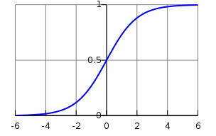

# **Logistic regression**

* To linear classification problems (categorical outcome)

* Only deal with numeric values (but you can do an dummy variable approach)

* have soft thershold, that can be interpreted as a probability of belonging to the class (can be easly adapted to a hard threshold)

* The returned value will be between 0 and 1

* The threshold must be a continuous and differentiable function

* This algorithm use the logistic function (para uma única variável $x$):
  $$
  Logistic(x)=\frac{1}{1+e^{-x}}=\frac{e^x}{1+e^x}
  $$
  

* Faremos o fit considerando a variável independente (z) como sendo ($\beta_1z + \beta_0$)

* Then its just apply some training method (ex: maximum likelihood)

* **Maximum likelihood method**

  * general method, described here for convenience

  * we try to find β̂0 and β̂1 such that plugging
    these estimates into the model yields a number
    close to one for all individuals who defaulted

  * The estimates β̂0 and β̂1 are chosen to maximize the likelihood function

  * likelihood function:

    

* **Multiple regression**

  * extensão natural da regressão univariada 

  * ou seja, a função logistica será:

    

    > $\bold{X} = (X1, . . . , Xp)$ are p predictors.

* **Non-binary classification**

  * Até pode ser feito expandindo a função logística (em uma ideia semalhante ao que foi feito em *teoria de resposta ao item*)
  * Porem isso raramente é feito, e existem algoritos melhores para predição multi-classe

# Resultados do algoritmo

* Os dados não foram selecionados com muita seriedade, foi mais para testar o algoritmo
* Selecionou-se alguns campus que, olhando a curva de carga, pareciam ter características anormais, e usou-se isso para treinar o algoritmo
* O que foi considerado consumo anormal
  * oscilações de alta frequencia (aqueles chaveamentos, spikes)
  * Oscilações de baixa frequencia (o consumo medio varia ao longo da noite)
  * Fator de carga ruim
  * Tenham um consumo muito alto em relação ao dia (ou seja, campus que provavelmente deixam muitos equipamentos ligados)
* Análise dos resultados

