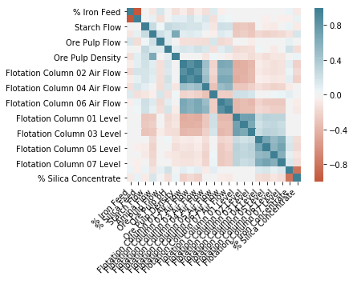
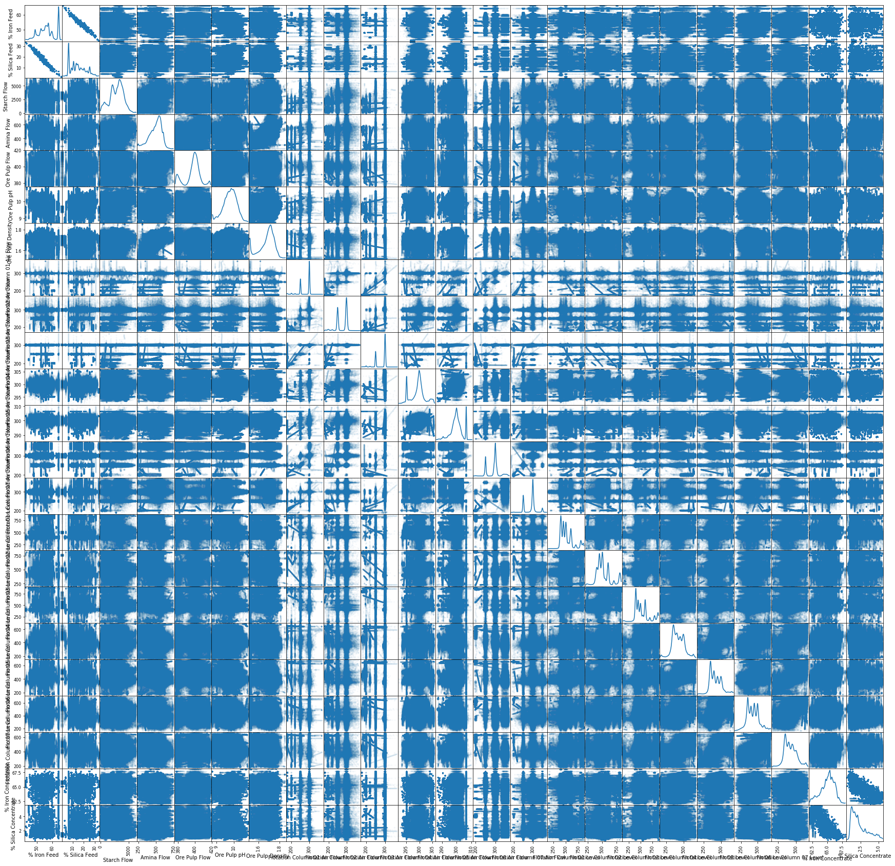

# Análise dos dados

* Objectives
  * predict the % of silica in the iron ore concentrate (last column)
  * preferencialmente sem usar a coluna “% Iron Concentrate”
* Correlação matrix plot (the printed matrix is in a txt file)

* variables pair plot (with alpha)

* Análise das linhas
  * Flotation Column 06 Level
    * não importa

Olá Eduardo, tudo bem? 

Estou entrando em contato pois gostaria de discutir com o senhor alguns resultados que 

