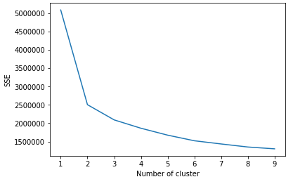
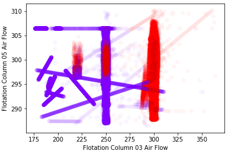
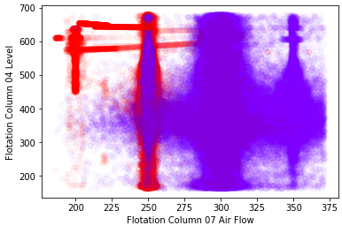
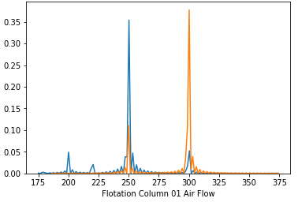
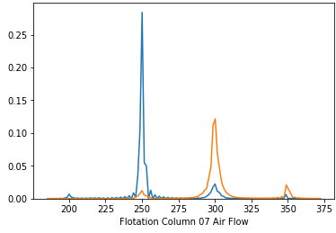

## **Algoritmo**

* **Pré processamento**
  * Normalização min-max
  * Observando que muitas das features não possuiam relação com o *air flow*, pesou-se cada coluna pela sua correlação (pearson correlation) com a coluna Flotation Column 01 Air Flow, diminuindo o ruído no resultado final
  * Desconsiderou-se a feature *date*, pois estamos interessados em analisar o ponto instantâneo de operação
* **Algoritmo de clustering**
  * Optou-se pelo algoritmo K means, pela simplicidade e facilidade de implementação
  * Utilizou-se o *elbow method* para identificar o numero ideal de clusters: 2

## **Resultados**

* Plotando algumas variáveis, separadas pelos clusters:

* **Distribution plot for *Flotation Column 01 Air Flow***

  * Cluster 1
    * count: 493578
    * mean: 298.8
    * std: 7.6 
  * Cluster 2
    * count: 243875
    * mean: 242.3
    * std: 19.9

  

* **Distribuition plot for *Flotation Column 07 Air Flow***

  * Cluster 1
    * count: 493578
    * mean: 303.8
    * std: 20.1 
  * Cluster 2
    * count: 243875
    * mean: 264.3
    * std: 24.9

  

