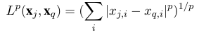
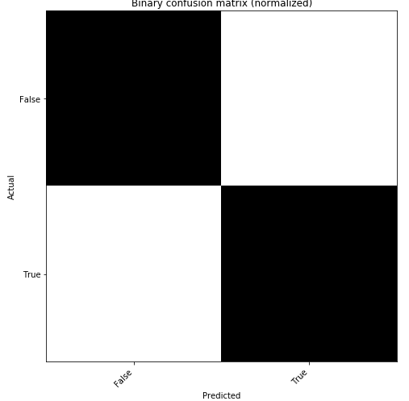
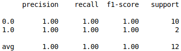

[TOC]

# Fundamentação teórica

## Pré processamento dos dados

* **Resampling**
  * Change the granularity of the data
  * Can be used to correct imbalanced classes (upsampling the little and downsamples the big)
  * Podemos obter mais features sobre os dados ao utilizarmos varias funções de agregação (ex: média, variância, amplitude) sobre a mesma coluna
  * Upsampling
    * increase the frequency of the samples
    * interpolate to generate new observations
  * Downsampling
    * decrease the frequency of the samples
    * summarize (using a defined aggregation function) observations

* **Normalization**

  * or *scaling*

  * Bota tudo entre 0 e 1

## Algoritmo K nearest neiborgs

* Aprendizado supervisionado 
* To classification 
* Baseado em distância
* Lazy algorithm (non parametric, store everything in memory)
* Hipótese base: dados com a mesma saída estão próximos no espaço de entrada
* Cada objeto é um ponto no espaço de entrada 
* O resultado é uma aproximação local 
* **Utilização**
  * rapido para treinar, lento para classificar (pois ele não gera um modelo, então precisa comparar com todos os dados toda vez)
  * Não tão bom para classes proximas 
  * Don’t accept nominal variables
  * The input shoud be normalized 
  * Por ser baseado em distância, é ruim de ser usado para problemas com grande dimensionalidade (pesquise sobre *curse of dimensionality*)
* **Funcionamento**
  * Input parameters: k, distance metric
  * Calcula a distância do ponto até todos os elementos do training set
  * Compara com os K vizinhos mais proximos e identifica o grupo ao qual ele mais se assemelha 
  * Classifica o dado de acordo com a moda dos k vizinhos mais proximos
  * Ou seja, minimiza a função custo 1-0
  * K deve ser impar 
  * Larger K: less sensible to small patterns (more bias)
  * Smaller K: more sensible to outliers (more variance)
* **Variation: weighted voting**
  * Closer neighbors have more weight 
* **Variação: enxugando o subconjunto**
  * podemos melhorar usando só um subconjunto bem determinado (subconjunto de protótipos) para classificar os proximos dados
  * eliminamos dados repetidos, ruidosos ou irrelevantes 
  * algoritmo de Elminação sequencial: vamos retirando do subconjunto aqueles objetos que já são corretamente classificados 
  * Algoritmo de Inserção sequêncial: vamos inserindo no subconjunto apenas os objetos que são classificados incorretamente pelo subconjunto atual 
* **Variation: k-dimention tree**
  * or just *k-d tree* 
  * Acelerando a classificação
  * Ao invés de uma busca linear, podemos classificar usando uma arvore binária balanceada, com dimensões (sendo k o numero de variáveis)
  * the construction of a one-dimensional balanced binary tree

# Desenvolvimento

## Overview do código
  * Os dados foram exportados do PostgreeSQL para CSV

  * O programa python importa esses dados

  * Preprocessamento: reduz a dimensionalidade (resample com média e variância) e normaliza

  * Machine learning: algoritmo KNN (k=5)

  * Distance metric used: minkowski distance with p=2 (euclidian):

    

* **Libraries used**

  * Numpy: linear algebra and array implementation
  * Pandas: data analysis, cleaning and preparations
  * Scikit learn: machine learning algorithms and functions
  * Matplotlib: data visualization
## Resultados

* **Confusion matrix**
  * $C_{i,j}$ is equal to the number of observations known to be in group $i$ but
    predicted to be in group $j​$
  * The elements are whole numbers (not rates)
  * Main diagonal: right predicted
  * We can also normalize, and add colors to the cells
  * To our data, the result was:

* **Classification report**
  * Build a text report showing the main classification metrics (precision, recall, f score, suport, etc)
  * As medidas utilizadas sao para classificadores binários (duas classes), mas podem ser facilmente generalizados (geralmente tomamos uma como positiva e as demais como negativas)

